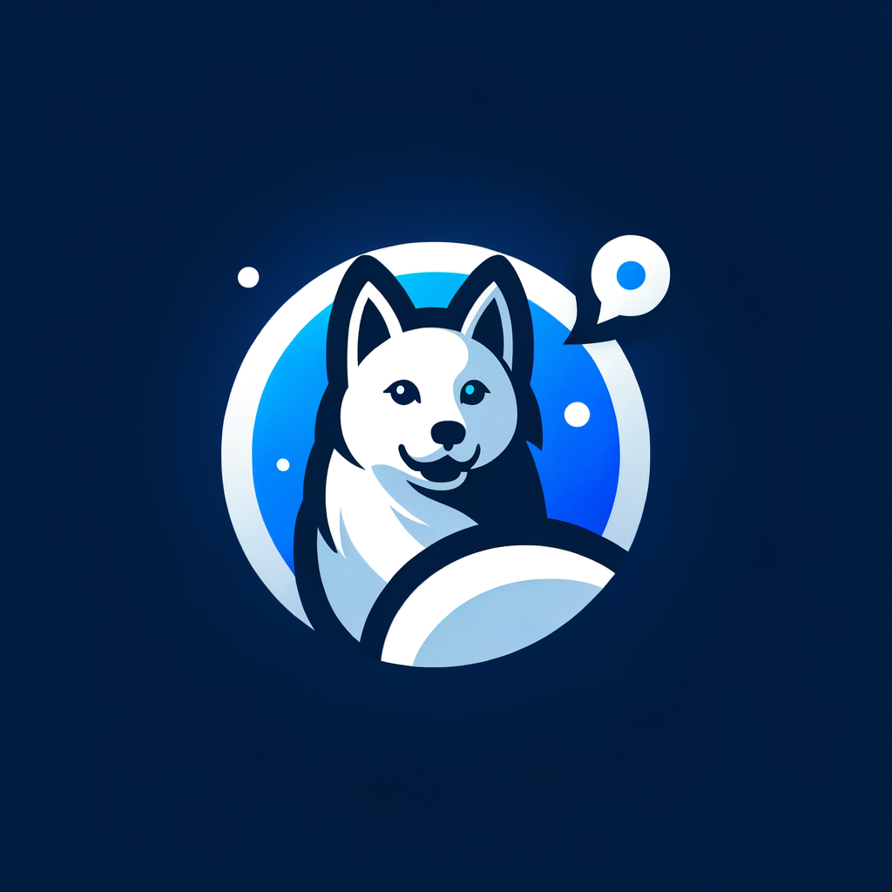

  
  <a href="https://docs.librechat.ai">
    <h1 align="center">PhantomChat</h1>
  </a>

  <a href="https://docs.librechat.ai"> 
    

# 📃 Features
 - 🖥️ UI matching ChatGPT, including Dark mode, Streaming, and 11-2023 updates
 - 💬 Multimodal Chat:
     - Upload and analyze images with GPT-4 and Gemini Vision 📸
     - More filetypes and Assistants API integration in Active Development 🚧 
 - 🌎 Multilingual UI:
     - English, 中文, Deutsch, Español, Français, Italiano, Polski, Português Brasileiro,
     - Русский, 日本語, Svenska, 한국어, Tiếng Việt, 繁體中文, العربية, Türkçe, Nederlands
 - 🤖 AI model selection: OpenAI API, Azure, BingAI, ChatGPT, Google Vertex AI, Anthropic (Claude), Plugins
 - 💾 Create, Save, & Share Custom Presets
 - 🔄 Edit, Resubmit, and Continue messages with conversation branching
 - 📤 Export conversations as screenshots, markdown, text, json.
 - 🔍 Search all messages/conversations
 - 🔌 Plugins, including web access, image generation with DALL-E-3 and more
 - 👥 Multi-User, Secure Authentication with Moderation and Token spend tools
 - ⚙️ Configure Proxy, Reverse Proxy, Docker, many Deployment options, and completely Open-Source
